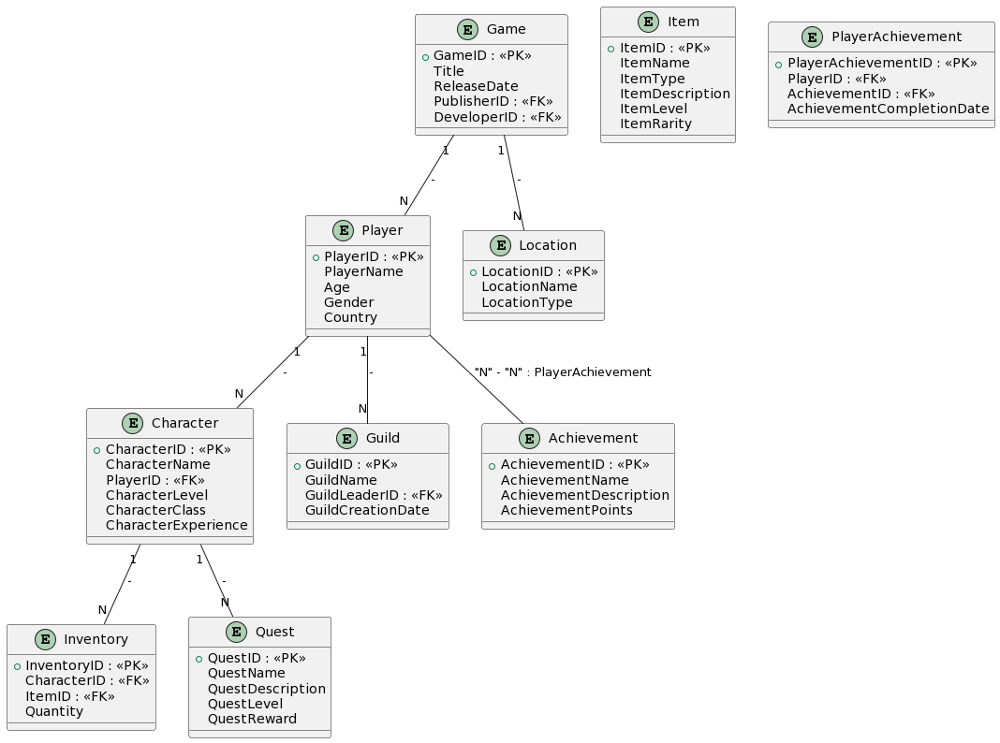
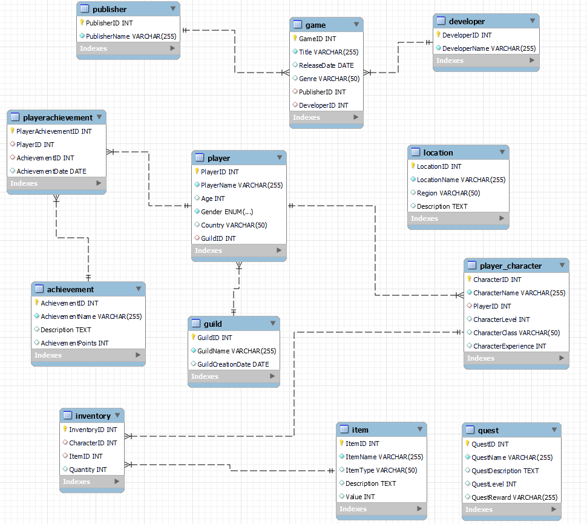

# Curso de Fundamentos de Bases de Datos

## Descripción

Este repositorio contiene mis apuntes del curso de Fundamentos de Bases de Datos. A lo largo del curso, exploré los siguientes temas:

## Contenido del Curso

1. **Bienvenida y Contexto Histórico**: Introducción a los conceptos básicos y al contexto histórico de las bases de datos.

2. **Introducción a las Bases de Datos Relacionales**: Exploración de las bases de datos relacionales, su historia y funcionamiento.

3. **Diagrama Entidad-Relación (ER)**: Aprendizaje sobre la creación de Diagramas ER para el diseño de bases de datos.

4. **Diagrama Físico y Normalización**: Cobertura de tipos de datos, constraints y normalización en bases de datos relacionales.

5. **SQL y RDBMS (MySQL)**: Uso de SQL para consultar y gestionar bases de datos relacionales, junto con la instalación de un RDBMS.

6. **Consultas y Manipulación de Datos**: Cómo realizar consultas y manipular datos en bases de datos relacionales utilizando SQL.

7. **Introducción a las Bases de Datos No Relacionales**: Exploración de bases de datos no relacionales, tipos y jerarquía de datos.

8. **Proyecto Final**: Aplicación de conocimientos en un proyecto para transformar una aplicación en una base de datos no relacional.

9. **Bases de Datos en la Vida Real**: Uso de bases de datos en diversos campos, como Big Data, Machine Learning y Data Science.

10. **¿Por qué aprender bases de datos hoy?**: Reflexión sobre la relevancia de aprender bases de datos en el mundo actual.

Espero que estos apuntes del curso sean útiles para tu aprendizaje y te ayuden a comprender mejor los fundamentos de las bases de datos.

# Proyecto del curso: Base de datos de juego RPG

Se realizaron diagramas consultas SQL para crear una base de datos de un juego de rol (RPG, Role-Playing Game). La base de datos está diseñada para gestionar varios aspectos del juego RPG, incluyendo jugadores, personajes, gremios, objetos, misiones, logros y más.

## Esquema de la Base de Datos

El esquema de la base de datos se representa mediante diagramas PlantUML, que ofrecen una vista general de la estructura de la base de datos y las relaciones entre las entidades.

### Diagrama de Entidad-Relación Preliminar (ER)

### Diagrama de Entidad-Relación Final

## Consultas SQL

El repositorio incluye consultas SQL para crear las tablas de la base de datos y llenarlas con datos iniciales. A continuación, se presentan algunas de las tablas clave y sus consultas asociadas:

- **Tabla de Jugadores:** Contiene información de los jugadores.
  - Consulta SQL: [Crear Tabla de Jugadores](./SQL%20Files%20RPG/Players.sql)

- **Tabla de Gremios:** Almacena información sobre diferentes gremios.
  - Consulta SQL: [Crear Tabla de Gremios](./SQL%20Files%20RPG/Guilds.sql)

- **Tabla de Personajes:** Gestiona datos de personajes y sus asociaciones con jugadores.
  - Consulta SQL: [Crear Tabla de Personajes](./SQL%20Files%20RPG/Characters.sql)

- **Tabla de Objetos:** Almacena detalles de objetos para el juego.
  - Consulta SQL: [Crear Tabla de Objetos](./SQL%20Files%20RPG/Item.sql)

- **Tabla de Inventario:** Realiza un seguimiento de los objetos en el inventario de un personaje.
  - Consulta SQL: [Crear Tabla de Inventario](./SQL%20Files%20RPG/Inventory.sql)

- **Tabla de Misiones:** Gestiona detalles de misiones y recompensas.
  - Consulta SQL: [Crear Tabla de Misiones](./SQL%20Files%20RPG/Quest.sql)

- **Tabla de Logros:** Contiene logros y sus puntos asociados.
  - Consulta SQL: [Crear Tabla de Logros](./SQL%20Files%20RPG/Achievement.sql)

- **Tabla de Logros de Jugadores:** Realiza un seguimiento de los logros de los jugadores.
  - Consulta SQL: [Crear Tabla de Logros de Jugadores](./SQL%20Files%20RPG/PlayerAchievement.sql)

- **Tabla de Localizaciones:** Almacena información sobre ubicaciones dentro del juego.
  - Consulta SQL: [Crear Tabla de Localizaciones](./SQL%20Files%20RPG/Location.sql)

- **Tabla de Juego:** Gestiona información sobre el juego RPG, incluyendo su título, fecha de lanzamiento, editor y desarrollador.
  - Consulta SQL: [Crear Tabla de Juego](./SQL%20Files%20RPG/Game.sql)

- **Tabla de Desarrolladores:** Contiene información sobre los desarrolladores del juego.
  - Consulta SQL: [Crear Tabla de Desarrolladores](./SQL%20Files%20RPG/Developer.sql)

- **Tabla de Editores:** Almacena información sobre los editores del juego.
  - Consulta SQL: [Crear Tabla de Editores](./SQL%20Files%20RPG/Publisher.sql)

**NOTA** Existen algunas consultas adicionales que son para fines prácticos de la clase, complementan los apuntes.

## Uso

Puedes utilizar estas consultas SQL para configurar la base de datos RPG y llenarla con datos iniciales. Personaliza los datos y el esquema según tus requisitos para tu juego RPG.

